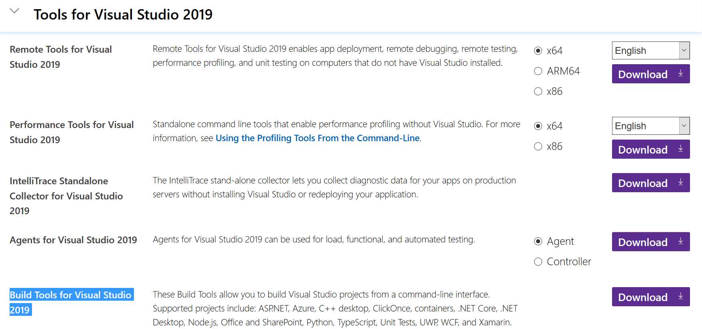
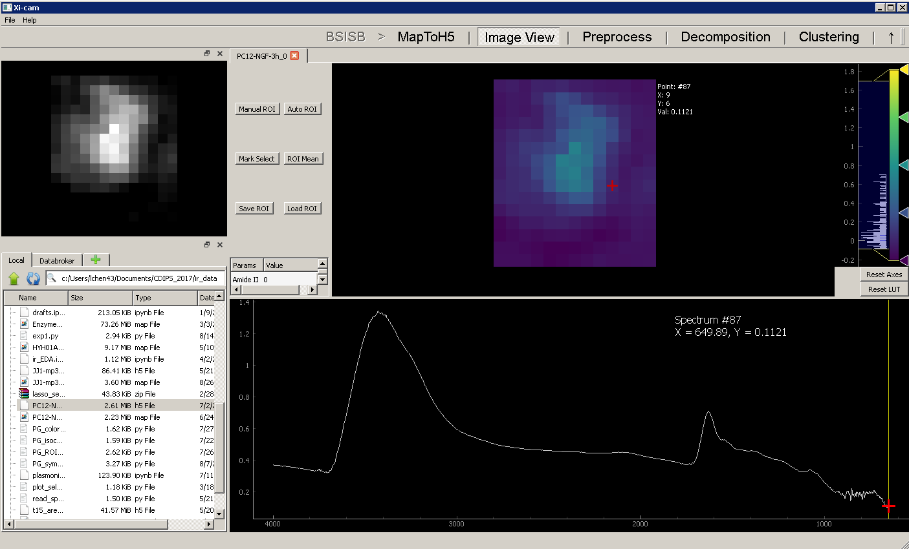

BSISB (A Xi-cam plugin for FTIR data analysis)
==============================================

Version number: 0.1

Author: Liang Chen

## Installation
---------------------
### Install C++ build tools (Windows OS only):

Download and install "Build Tools for Visual Studio" from [here](https://visualstudio.microsoft.com/downloads/).
See the screenshot below for reference:

### Install git and python3.7.7:

You will need to ensure that you have both git and python3 installed on your system for Xi-cam installation.

**MacOS**

Open the Terminal application (in Applications/Utilities). In the terminal, check to see if git is installed by typing `git --version`. Either a version number will be printed, indicating git is already installed, or a dialog will open asking The “git” command requires the command line developer tools. Would you like to install the tools now? Click the **Install** button to install the developer tools, which will install git for you.

You will also need to install python3.7.7. You can download python3.7.7 at [python.org](https://www.python.org/downloads/mac-osx/). You will want to get the macOS 64-bit installer if you are running any macOS version since Mavericks.

**Windows OS**

Download git [here](https://git-scm.com/download/win) and follow the installer’s instructions. This will install **Git for Windows**, which provides a **Git Bash** command line interface as well as a **Git GUI** graphical interface for git.

You will want to go to the python3.7.7 download page at [python.org](https://www.python.org/downloads/release/python-377/). For modern systems, install the **Windows x86-64 executable installer** at the bottom.

When you run the installer, make sure sure to check the box that says **Add Python 3.x to PATH** to ensure that the interpreter will be placed in your execution path.

### Create and Activate a Virtual Environment:

The latest python3 version comes with the venv module, which can be used to create a virtual environment. A virtual environment is a sequestered space where you can install and uninstall packages without modifying your system’s installed packages.

Create a virtual environment for installing the Xi-cam components and dependencies. You will then want to activate the virtual environment you created so that any packages you install with python’s package manager, **pip**, will be installed into that active virtual environment. In the commands below, create a virtual environment called **venv_xicam** and activate it:

**Linux/macOS**

    $ python3 -m venv venv_xicam
    $ source venv_xicam/bin/actviate

**Windows OS**

    $ python -m venv venv_xicam
    $ venv_xicam\Scripts\activate 

### Install Xi-CAM:
Before installing Xi-cam, run the following commands:

    $ python -m pip install --upgrade pip
    $ pip install wheel
    $ pip install --upgrade setuptools
    $ pip install numcodecs

Then run the following commands to install Xi-cam:

    $ pip install xicam

### Install lbl_ir and Xi-cam.BSISB plugin:
Run the following commands to install lbl_ir package and Xi-cam.BSISB plugin:

    $ git clone https://github.com/lchen23/Xi-cam.BSISB.git
    $ cd Xi-cam.BSISB/lbl_ir
    $ pip install -e .
    $ cd ..
    $ pip install -e .

### Run the Xi-cam.BSISB program:

Run the following command:

    $ xicam

### Run the Xi-cam.BSISB GUI from a new terminal:
First, activate the virtual environment, then run xicam:

**Linux/macOS**

    $ source venv_xicam/bin/actviate
    $ xicam

**Windows OS**

In Git bash:

    $ source venv_xicam/Scripts/activate
    $ xicam 

In Windows CMD:

    $ venv_xicam\Scripts\activate
    $ xicam 

After the Xi-cam GUI program launches, open the
`Xi-cam.BSISB/tests/PC12-NGF-3h.h5` file by double clicking the h5 file
in the file browser as shown below:

Contributing
------------

TBD

